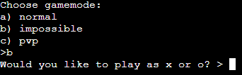

# Tic Tac Toe

Tic tac toe is a classic board game that anyone can play. This version of tic tac toe is made with Python code. 

Users can choose if they want to play against a computer or a friend. They win by placing 3 Xs or Os in a row. 

[Here is the live version](https://tic-tac-toe-kjb.herokuapp.com/)

## How to play
---

First, the game will ask you to pick one of three gamemodes:
- **Normal**

    In the "Normal" gamemode your opponent is a computer that makes randomized moves.

- **Impossible**

    In the "impossible" gamemode your opponent is a computer that makes moves based on an algorithm.

- **PVP**

    In the Player versus Player gamemode, you play with a friend.

When you have picked a gamemode, you will be asked if you want to be "X" or "O". ("X" will always make the first move.). When you have made your choice, the terminal will print a 3x3 board with 9 dots. Each dot is indexed 1 to 9. So 1 would be the top left and 9 would be the bottom right and so on. Once you have chosen your move. It will be the opponents turn. This will keep repeating until there is either a winner or a tie. At that point the game will ask you if you would like to play again or not. If you type "yes", the game will restart with the same gamemode and role that you previously chose. If you type "no", you will exit the game entirely. 

## Features
---

### Gamemode selection

At the start of the game, you will be asked what gamemode you want to play. You can choose between "normal", "impossible" or "pvp".

### Role Selection

After you have selected a gamemode, you will be asked to play as "X" or "O". As a rule in tic tac toe, X will always go first, which is why there is no role select in the "PVP" mode.

### Tic tac toe board

When you have chosen the gamemode and role, there will be a 3x3 sized board printed on the terminal. Each location on the board is marked with a dot ".". each dot is indexed 1 to 9. You make moves by typing the indexes. The board detects when there is a winner and prints the outcome of the game out on the terminal, aswell as the board in it's end state. If you type anything other than an index from 1 to 9, an error message will print. The error message encourages you to type "help". If you type "help" on the terminal it will print instructions on the terminal.

### Normal gamemode

In this gamemode you play against the computer. The computer is making completely randomized moves, making the gamemode very easy.

### Impossible gamemode

In this gamemode you play against the computer. The computer gets the moves from an algorithm called minimax. The idea of the algorithm is to play out all possible scenarios in which the computer itself won or tied the game out and follow the moves it made in order to win or tie. Making it quite literally impossible to beat the AI. It does this by looping through all possible moves in a copy of the tic tac toe board until it reaches an end scenario. These end scenarios return scores, -1 for losing, 0 for tie and 1 for winning. If the end scenarios return anything greater than -1 then the computer will choose this move as it has led to a win or tie.

### PVP

In this gamemode, you play against a friend. "X" will be asked to make a move, after that, "O" will be asked to make a move until one of you wins.

### play again

This feature is presented at the end of a game. The terminal asks you if you want to play again or not. If you type "yes", the game will restart with the same gamemode and difficulty that you previously chose, if you type "no" the game will exit entirely.

## Data model

---

Because of the simplicity of the game, I chose to use **global** variables as a model. 

The entire board is stored in a global variable aswell as the player roles. These are frequently used variables in the code, it is much easier to have them be global than to have to pass them between functions.

The global variable "WINNER" is used to signal game over and that there is a winner.

The gamemode is also stored in a global varible to make sure the game sticks to whatever game mode the user chose at the beginning.

## Testing
---

- I have tried passing the code through a pep8 linter and finding no issues. 
- I have manually tested the game by playing it as intended.
- I have manually tested the game by typing invalid input with no crashes.
- I have tested it in the CI mock terminal in Heroku.

### Bugs

There are no known bugs in the program.

### Solved bugs

- Input crash for pvp - if the "O" player puts in a number that is too big, the game crashes, I fixed this by limiting the size of the number that can be entered.

- Exit crash - At game over, when asked to play again, the game would crash instead of exiting. I fixed this by using sys.exit() instead of just exit(). 

- Exception TypeError - At the start of the game, when user makes a move. The game would crash if you typed letters. This is because I tried raising a ValueError() with brackets. This was finally resolved by simply removing the brackets. 

### Validator testing

The project has been tested in the pep8 validator and returned no errors. 

## Deployment
---

This project was deployed using Code Institutes mock terminal for Heroku.

- Steps for deployment
    
    - Fork or clone this repository
    - Create a new heroku application
    - Set buildbacks to python and NodeJS in that order 
    - Link the Heroku app in the repository
    - Click Deploy

## Credits
---

- The minimax function was made with the help of a [tutorial](https://www.youtube.com/watch?v=Bk9hlNZc6sE)

- The check_winner function was inspired by a [reddit thread](https://www.reddit.com/r/learnpython/comments/v8bscr/tic_tac_toe_win_condition/).